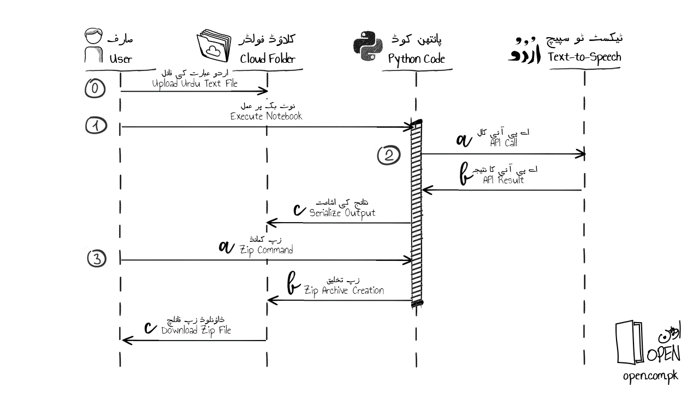

# Generating Urdu Audio Files using Google Text-to-Speech
## Why?
Urdu audio files need to be generated from Urdu text so they can be embedded into a Microsoft PowerPoint file. 
## What?
Jupyter Notebook that executes in Google Colab to read Urdu text from a file and generate audio files using the Google Text-to-Speech engine.

## How?
*The following steps create the audio files.*
### 0. Upload Urdu Text File
The user (or developer) uploads the Urdu text file to the cloud folder.
### 1. Execute Python Notebook
The Python notebook on Google Colab is executed.
### 2. Call Google Text-to-Speech API and serialize output
a. The code calls the text-to-speech API.
b. The API returns the audio output.
c. The audio output is serialized and stored as files in the cloud folder.
### 3. Generate and download zip file
a. The user issues a zip command using Python code.
b. The code creates a zip archive containing the audio files and stores it in a cloud folder.
c. The zip file is downloaded bu the user.
